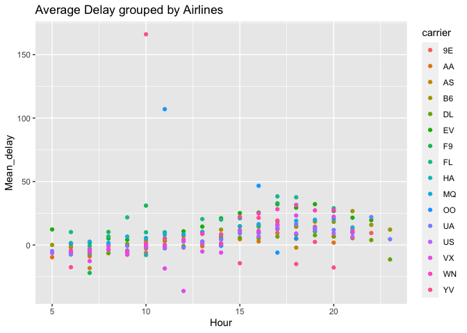
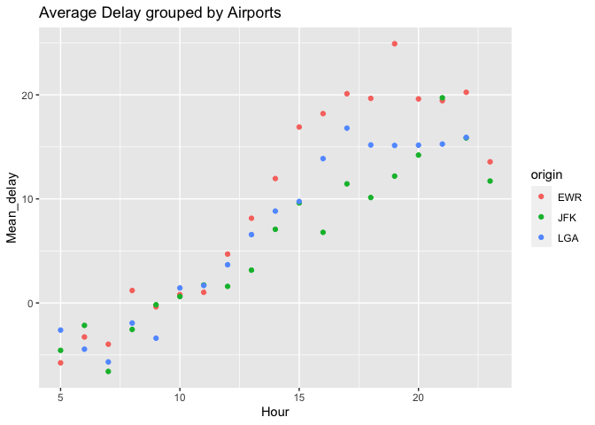
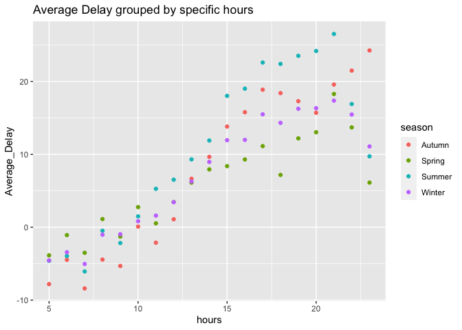

HW2
================
Xinyi Wang
2022-10-04

``` r
library(ggplot2)
library(dplyr)
```

    ## 
    ## 载入程辑包：'dplyr'

    ## The following objects are masked from 'package:stats':
    ## 
    ##     filter, lag

    ## The following objects are masked from 'package:base':
    ## 
    ##     intersect, setdiff, setequal, union

``` r
library(nycflights13)
library(tidyverse)
```

    ## ─ Attaching packages ──────────────────── tidyverse 1.3.1 ─

    ## ✓ tibble  3.1.4     ✓ purrr   0.3.4
    ## ✓ tidyr   1.1.4     ✓ stringr 1.4.0
    ## ✓ readr   2.1.1     ✓ forcats 0.5.1

    ## ─ Conflicts ───────────────────── tidyverse_conflicts() ─
    ## x dplyr::filter() masks stats::filter()
    ## x dplyr::lag()    masks stats::lag()

``` r
flights
```

    ## # A tibble: 336,776 × 19
    ##     year month   day dep_time sched_dep_time dep_delay arr_time sched_arr_time
    ##    <int> <int> <int>    <int>          <int>     <dbl>    <int>          <int>
    ##  1  2013     1     1      517            515         2      830            819
    ##  2  2013     1     1      533            529         4      850            830
    ##  3  2013     1     1      542            540         2      923            850
    ##  4  2013     1     1      544            545        -1     1004           1022
    ##  5  2013     1     1      554            600        -6      812            837
    ##  6  2013     1     1      554            558        -4      740            728
    ##  7  2013     1     1      555            600        -5      913            854
    ##  8  2013     1     1      557            600        -3      709            723
    ##  9  2013     1     1      557            600        -3      838            846
    ## 10  2013     1     1      558            600        -2      753            745
    ## # … with 336,766 more rows, and 11 more variables: arr_delay <dbl>,
    ## #   carrier <chr>, flight <int>, tailnum <chr>, origin <chr>, dest <chr>,
    ## #   air_time <dbl>, distance <dbl>, hour <dbl>, minute <dbl>, time_hour <dttm>

What time of day should you fly if you want to avoid delays as much as
possible? Does this choice depend on anything? Season? Weather? Airport?
Airline? Find three patterns (“null results” are ok!). Write your
results into Rmarkdown. Include a short introduction that summarizes the
three results. Then, have a section for each finding. Support each
finding with data summaries and visualizations. Include your code when
necessary.

\#What time of day should you fly if you want to avoid delays as much as
possible?

``` r
flights %>% 
  filter(!is.na(dep_delay & arr_delay)) %>% #leave the flights that are not cancelled
  group_by(hour) %>% 
  filter(arr_delay>0) %>% 
  arrange(-arr_delay) %>%
  summarise(arr_delay = mean(arr_delay, na.rm=TRUE), 
            n = n(),) %>%
  ggplot(aes(x = hour, 
             y = arr_delay)) +    
  geom_point(color = "green") +
  ggtitle("Average Delay grouped by specific hours") + 
  labs(x="Hours in a day", y="Average Delay")
```

<!-- -->

**The flights at 7:00 pm at night has the longest average delay, and the
flights at midnight and early mornings tend to have shorter average
delay. In this case, if the flights want to avoid arrival delay, it
should fly at midnight and early morning.**

# Pattern 1: Airlines

``` r
unique(flights$carrier) #check how many different types of airlines
```

    ##  [1] "UA" "AA" "B6" "DL" "EV" "MQ" "US" "WN" "VX" "FL" "AS" "9E" "F9" "HA" "YV"
    ## [16] "OO"

``` r
flights %>% 
  filter(!is.na(dep_delay & arr_delay)) %>% #leave the flights that are not cancelled
  group_by(hour, carrier) %>% 
#  filter(carrier == "UA") %>% 
#  arrange(-flights$arr_delay) %>%
  summarise(arr_delay = mean(arr_delay, na.rm=TRUE), 
            n = n(),) %>% #define mean arrival delay
  ggplot(aes(x = hour,
             y = arr_delay, color = carrier)) +
  ggtitle("Average Delay grouped by Airlines") + 
  labs(x="Hour", y="Mean_delay") +
  geom_point()
```

    ## `summarise()` has grouped output by 'hour'. You can override using the `.groups` argument.

<!-- -->

**OO, EV, YV are the top three airlines that have the longest average
arrival delay than the rest of the airlines. In this case, if we want to
avoid arrival delay, we should try to avoid the the airlines named OO,
EV, YV.**

# Pattern 2: Airports

``` r
flights %>% 
  filter(!is.na(dep_delay & arr_delay)) %>% #leave the flights that are not cancelled
  group_by(hour,origin) %>% 
  summarise(arr_delay = mean(arr_delay, na.rm=TRUE), 
            n = n(),) %>% #define mean arrival delay
  ggplot(aes(x = hour,
             y = arr_delay,
         colour = origin)) +
  ggtitle("Average Delay grouped by Airports") + 
  labs(x="Hour", y="Mean_delay") + 
  geom_point()
```

    ## `summarise()` has grouped output by 'hour'. You can override using the `.groups` argument.

<!-- -->

**The EWR airport has the largest average arrival delay, which is
followed by LGA airport and JFK airport. In this case, if we want to
avoid the arrival delay, we should try to avoid arriving at EWR airport,
LGA airport and JFK airport.**

# Pattern 3: Season(Spring, summer, autumn, winter)

``` r
#Spring = flights[month = c(1,2,3)]
#Summer = flights(month = c(4,5,6))
#Autumn = flights(month = c(7,8,9))
#Autumn = flights(month = c(10,11,12))
flights %>% 
  filter(!is.na(dep_delay & arr_delay)) %>%
  mutate(season = ifelse(month == c(1, 2, 3), "Spring", ifelse(month == c(4, 5, 6), "Summer", ifelse(month == c(7, 8, 9), "Autumn", "Winter")))) %>%
  group_by(hour, season) %>% 
  summarise(arr_delay = mean(arr_delay, na.rm=TRUE), 
            n = n(),) %>%
  ggplot(aes(x = hour, y = arr_delay,
         colour = season)) +    
  ggtitle("Average Delay grouped by specific hours")+ 
  labs(x="hours", y="Average_Delay") +
  geom_point()
```

    ## Warning in month == c(1, 2, 3): 长的对象长度不是短的对象长度的整倍数

    ## Warning in month == c(4, 5, 6): 长的对象长度不是短的对象长度的整倍数

    ## Warning in month == c(7, 8, 9): 长的对象长度不是短的对象长度的整倍数

    ## `summarise()` has grouped output by 'hour'. You can override using the `.groups` argument.

<!-- -->

**The flights at summer tend to have the longest average arrival delay,
and the flights at autumn has the second longest average arrival delay,
and the flights at winter has the third longest average arrival delay,
and the flights at spring has the shortest average arrival delay. In
this case, if we want to avoid arrival delay, we should try to fly at
summer and avoid fly at winter.**
